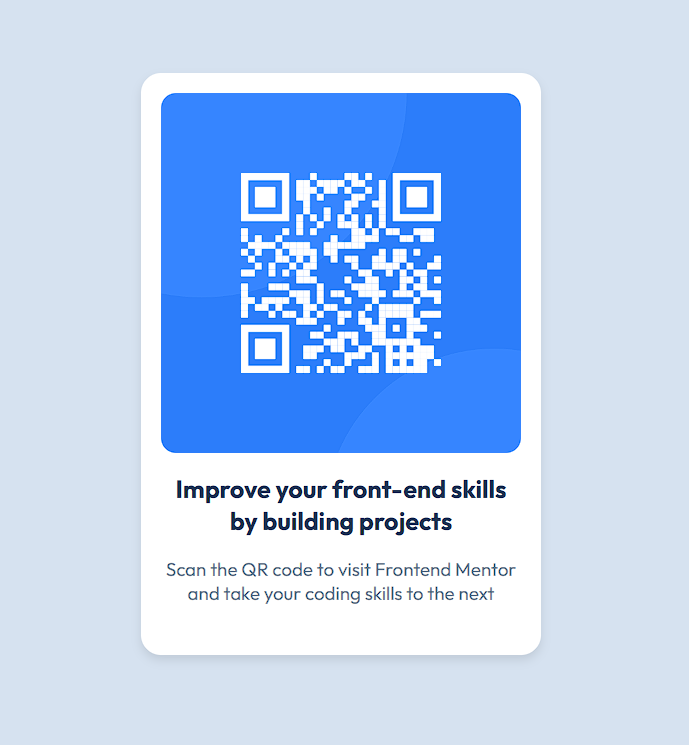

# 📱 QR Code Component — Frontend Mentor Challenge

This is my solution to the [QR Code Component challenge](https://www.frontendmentor.io/solutions/qr-card-simple-solution-JG_o30KxYS) on Frontend Mentor. It's a simple yet elegant card layout featuring a QR code and descriptive text.

## 🚀 Live Site  
Check out the hosted version here: [Live Preview](https://kakarot26.github.io/QR-Card-FM-Solution/)

## 🛠️ Built With
- HTML5
- CSS3
- Flexbox

## 📸 Screenshot
 

## 🎯 What I Learned
- How to center content using Flexbox
- Applying consistent spacing and typography
- Using semantic HTML for accessibility

Feel free to explore and share feedback!

